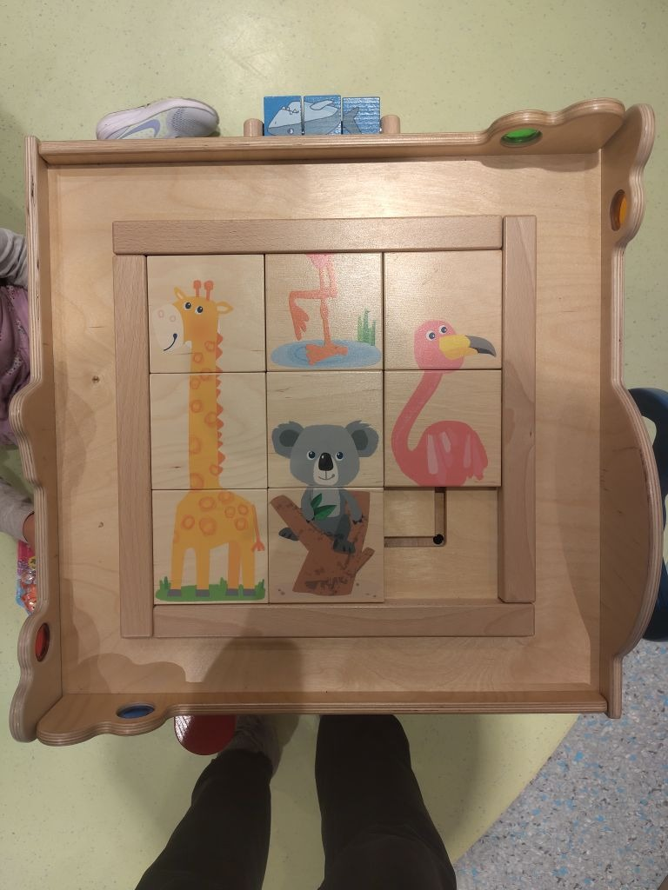

# 🧩 Tier-Schiebepuzzle Studio

[](https://basecore.github.io/tier-schiebepuzzle-studio/)
[](https://www.perplexity.ai/)
[](LICENSE)
[](#technik)

> Eine kindgerechte, mobile-first Web-App für 3×3-Schiebepuzzles – vollständig lokal im Browser, ohne Backend, Tracking, CDN-Abhängigkeiten oder Build-Schritt.

## ▶ App starten

**[Hier die Web-App öffnen: basecore.github.io/tier-schiebepuzzle-studio](https://basecore.github.io/tier-schiebepuzzle-studio/)**

> Die URL funktioniert, nachdem GitHub Pages in den Repository-Einstellungen aktiviert und erfolgreich bereitgestellt wurde. Details stehen im Abschnitt [GitHub Pages aktivieren](#github-pages-aktivieren).

---

## Inhalt

- [Über das Projekt](#über-das-projekt)
- [Puzzlefotos und Tierkacheln](#puzzlefotos-und-tierkacheln)
- [Funktionsübersicht](#funktionsübersicht)
- [Varianten-Code](#varianten-code)
- [BFS und Lösbarkeit](#bfs-und-lösbarkeit)
- [Foto- und Kameraimport](#foto--und-kameraimport)
- [Lokale Nutzung](#lokale-nutzung)
- [Tests](#tests)
- [GitHub Pages aktivieren](#github-pages-aktivieren)
- [PWA installieren](#pwa-installieren)
- [Datenschutz](#datenschutz)
- [Projektstruktur](#projektstruktur)
- [Versionierung](#versionierung)
- [Bekannte Grenzen](#bekannte-grenzen)
- [Mit KI erstellt](#mit-ki-erstellt)
- [Lizenz](#lizenz)

---

## Über das Projekt

**Tier-Schiebepuzzle Studio** digitalisiert ein klassisches 3×3-Schiebepuzzle mit acht Kacheln und einem freien Feld. Es wurde für Smartphone-Bedienung im Hochformat entworfen, funktioniert aber ebenso auf Tablet und Desktop.

Eine Kachel kann nur verschoben werden, wenn sie direkt links, rechts, oberhalb oder unterhalb des freien Felds liegt. Ziel ist es, alle Kacheln in den definierten Zielzustand zu bringen.

Die Anwendung läuft vollständig clientseitig:

- Kein Benutzerkonto
- Kein Server-Backend
- Kein Tracking und keine Analytics
- Keine externen JavaScript- oder CSS-Bibliotheken
- Kein Node.js, kein npm und kein Build-Schritt erforderlich
- Nach dem ersten erfolgreichen Laden offline nutzbar

---

## Puzzlefotos und Tierkacheln

### Ausgangszustand

Das folgende Foto dokumentiert den aktuellen aufgebauten Zustand des physischen Tier-Schiebepuzzles:



Der zugehörige Varianten-Code lautet:

```text
G1,F3,F1,G2,K1,F2,G3,K2,.
```

### Kachelbezeichnungen

| Kürzel | Tier | Bereich |
|---|---|---|
| `G1` | Giraffe | Kopf |
| `G2` | Giraffe | Hals / Mittelteil |
| `G3` | Giraffe | Beine / Unterteil |
| `F1` | Flamingo | Kopf |
| `F2` | Flamingo | Körper / Mittelteil |
| `F3` | Flamingo | Beine / Unterteil |
| `K1` | Koala | Kopf |
| `K2` | Koala | Baum / Unterteil |
| `.` | — | Freies Feld |

Die zugehörigen Bildausschnitte liegen nachvollziehbar im Verzeichnis [`assets/tiles/`](assets/tiles/):

```text
assets/tiles/giraffe-kopf.jpg
assets/tiles/giraffe-hals.jpg
assets/tiles/giraffe-beine.jpg
assets/tiles/flamingo-kopf.jpg
assets/tiles/flamingo-koerper.jpg
assets/tiles/flamingo-beine.jpg
assets/tiles/koala-kopf.jpg
assets/tiles/koala-baum.jpg
```

### Gelöster Zustand

Für ein separates Foto des vollständig gelösten Puzzlebildes ist folgender Pfad vorgesehen:

```text
assets/original/puzzle-aufbau-geloest.jpg
```

Wenn aktuell nur das Foto des Ausgangszustands vorliegt, kann diese Datei zunächst dieselbe Aufnahme enthalten. Für eine genaue visuelle Gegenüberstellung sollte sie später durch ein echtes Foto des vollständig gelösten Puzzles ersetzt werden.

---

## Funktionsübersicht

### 🎮 Spielen

- Große, touchfreundliche Kacheln für Smartphones
- Responsive Darstellung für Smartphone, Tablet und Desktop
- Nur regelkonforme Nachbarzüge sind möglich
- Animierte Kachelbewegungen
- Zughistorie mit **Rückgängig**-Funktion
- Anzeige von:
  - eigenen Zügen
  - minimalen Zügen (**Par**)
  - Differenz zu Par
  - laufender Zeit im Format `MM:SS`
- **Tipp**: zeigt die nächste optimale Kachel und ihre Richtung
- **Im Löser öffnen**: übergibt den aktuellen Zustand direkt an den Auto-Löser
- Kindgerechte Erfolgsmeldung beim Lösen

### 🎲 Zufallsrätsel und Schwierigkeit

Die Zufallsvarianten werden nicht nur durch zufällige Mischzüge bewertet. Die App berechnet die tatsächliche minimale Distanz zum Ziel mittels BFS und ordnet erst dann die Schwierigkeit zu.

| Stufe | Bereich der minimalen Zugzahl |
|---|---:|
| 🌱 Leicht | 3–6 Züge |
| ⚡ Mittel | 7–12 Züge |
| 🔥 Schwer | 13–24 Züge |

Dadurch bedeutet „schwer“ tatsächlich eine größere minimale Lösungsdistanz.

### 🤖 Auto-Löser

Der integrierte Auto-Löser arbeitet mit **Breadth-First Search (BFS)**.

- Erkennt die Zustände `lösbar`, `unlösbar` und `ungültig`
- Liefert für jede lösbare Variante eine garantiert kürzeste Lösung
- Zeigt minimale Zugzahl und fortlaufende Schrittnummern
- Zeigt pro Zug Kachelname und Bewegungsrichtung
- Ermöglicht Start, Schritt zurück und Schritt weiter
- Zuglisten-Einträge sind direkt anklickbar
- Der Lösungszustand wird auf dem Spielfeld dargestellt

### ✏️ Varianten-Editor

- Visueller 3×3-Editor
- Palette mit allen acht Kacheln und dem freien Feld
- Gewählte Kachel antippen und danach ein Rasterfeld antippen
- Bereits platzierte Kacheln werden beim Setzen sinnvoll getauscht
- Live-Rückmeldung zu:
  - Vollständigkeit
  - Gültigkeit
  - Lösbarkeit
  - minimaler Zuganzahl bei lösbaren Varianten
- Aktuellen Zustand als Spiel starten
- Aktuellen Zustand im Löser öffnen
- Editor leeren
- Foto-Startzustand direkt laden

### 💾 Lokale Varianten

- Varianten mit einem Namen im Browser speichern
- Speicherung erfolgt nur lokal per `localStorage`
- Gespeicherte Varianten im Auswahlfeld verwalten
- Vor dem Löschen erfolgt eine Sicherheitsabfrage
- Es werden keine Varianten an einen Server übertragen

---

## Varianten-Code

Ein Varianten-Code beschreibt die neun Felder des 3×3-Rasters:

1. Erste Zeile von links nach rechts
2. Zweite Zeile von links nach rechts
3. Dritte Zeile von links nach rechts

Beispiel für den Foto-Startzustand:

```text
G1,F3,F1,G2,K1,F2,G3,K2,.
```

Beispiel für den Zielzustand:

```text
G1,G2,G3,F1,F2,F3,K1,K2,.
```

### Validierung

Die App weist unter anderem folgende Eingabefehler verständlich zurück:

- Eine Kachel kommt doppelt vor
- Eine Kachel fehlt
- Unbekannte Kachelkürzel
- Kein freies Feld
- Mehrere freie Felder
- Falsche Anzahl von Einträgen

Ein Code kann vollständig und syntaktisch gültig, aber trotzdem **unlösbar** sein. Warum das möglich ist, erklärt der nächste Abschnitt.

---

## BFS und Lösbarkeit

### Warum liefert BFS eine kürzeste Lösung?

Breadth-First Search untersucht die erreichbaren Spielzustände schichtweise:

1. Alle Zustände mit einem Zug Abstand
2. Danach alle Zustände mit zwei Zügen Abstand
3. Danach alle Zustände mit drei Zügen Abstand
4. Und so weiter

Wird das Ziel erstmals gefunden, kann keine kürzere Lösung existieren. Deshalb entspricht die vom BFS-Löser ausgegebene Zugfolge immer der minimalen Zugzahl.

### Warum sind manche Varianten unlösbar?

Bei einem normalen 3×3-Schiebepuzzle ist nicht jede beliebige Anordnung über erlaubte Schiebezüge erreichbar. Das hängt von der **Inversionsparität** ab.

Die App verwendet diese Eigenschaft als schnelle Vorprüfung:

- **Ungültig:** Code enthält Fehler, etwa doppelte oder fehlende Kacheln.
- **Gültig, aber unlösbar:** Alle Kacheln sind vorhanden, die Parität erlaubt aber keinen Weg zum Ziel.
- **Gültig und lösbar:** Die Parität stimmt; BFS kann eine minimale Zugfolge berechnen.

---

## Foto- und Kameraimport

Der Import-Workflow erzeugt neue 3×3-Puzzles aus eigenen Bildern – vollständig im Browser.

### Eingänge

- Lokale Bilddatei auswählen
- Smartphone-Kamera verwenden, sofern der Browser `getUserMedia` unterstützt
- Fallback auf die Dateiauswahl, wenn keine Kamera-API verfügbar ist

### Ablauf

1. Bild auswählen oder aufnehmen
2. Bild erscheint in der Canvas-Vorschau
3. Größe des quadratischen Puzzlebereichs einstellen
4. **„9 Kacheln erzeugen“** wählen
5. Die Anwendung schneidet den Bereich geometrisch in neun gleich große Ausschnitte
6. Die entstandenen Kacheln prüfen und im Editor zuordnen

### Wichtige Grenze

Die Anwendung behauptet ausdrücklich **keine automatische semantische Bilderkennung**. Sie erkennt also nicht verlässlich, ob ein Bildausschnitt „Giraffen-Kopf“, „Flamingo-Körper“ oder etwas anderes zeigt.

Automatisiert wird nur der geometrische 3×3-Zuschnitt. Die sinnvolle Zuordnung der Bildausschnitte zu Kachelrollen bleibt bewusst eine Nutzerentscheidung.

---

## Lokale Nutzung

Die Anwendung benötigt keine Installation von Paketen. Für die lokale Nutzung genügt ein statischer HTTP-Server in der Repository-Wurzel:

```bash
python3 -m http.server 8000
```

Anschließend im Browser öffnen:

```text
http://localhost:8000
```

> Ein lokaler HTTP-Server ist insbesondere für zuverlässige Service-Worker- und PWA-Tests sinnvoll. Das direkte Öffnen von `index.html` per `file://` kann Browser-Sicherheitsbeschränkungen auslösen.

---

## Tests

Eine einfache, ohne Toolchain lauffähige Browser-Testseite befindet sich unter:

```text
test.html
```

Sie prüft mindestens:

- ob der Foto-Startcode gültig ist
- ob der Foto-Startcode als lösbar erkannt wird
- ob der gelöste Zielzustand 0 Züge benötigt
- ob eine absichtlich vertauschte Permutation als unlösbar erkannt wird
- ob ein Code mit doppelter Kachel als ungültig erkannt wird

Zum Ausführen lokal starten und danach öffnen:

```text
http://localhost:8000/test.html
```

---

## GitHub Pages aktivieren

Damit der Link **„App starten“** funktioniert, muss GitHub Pages einmalig aktiviert werden:

1. Öffne das Repository: <https://github.com/basecore/tier-schiebepuzzle-studio>
2. Öffne **Settings**.
3. Wähle in der linken Navigation **Pages**.
4. Wähle unter **Build and deployment** bei **Source**: **Deploy from a branch**.
5. Wähle als Branch: **`main`**.
6. Wähle als Ordner: **`/(root)`**.
7. Klicke auf **Save**.
8. Warte auf das Deployment.
9. Öffne anschließend: <https://basecore.github.io/tier-schiebepuzzle-studio/>

Nach jedem weiteren Commit auf `main` veröffentlicht GitHub Pages die statische Anwendung erneut.

---

## PWA installieren

Nach der Pages-Veröffentlichung kann die App wie eine native Anwendung installiert werden.

### Android – Chrome oder Edge

1. App öffnen
2. Browsermenü öffnen
3. **„App installieren“** oder **„Zum Startbildschirm hinzufügen“** wählen

### iPhone und iPad – Safari

1. App in Safari öffnen
2. **Teilen** wählen
3. **„Zum Home-Bildschirm“** wählen

### Desktop – Chrome oder Edge

1. App öffnen
2. Installationssymbol in der Adressleiste anklicken
3. Oder Browsermenü → **„App installieren“** wählen

Der Service Worker legt die benötigten Anwendungsdateien nach dem ersten erfolgreichen Laden im Browser-Cache ab. Dadurch bleibt die App danach grundsätzlich offline verwendbar.

---

## Datenschutz

Datenschutz ist ein zentrales Merkmal dieses Projekts:

- Keine Benutzerkonten
- Kein Server-Backend
- Kein Tracking
- Keine Werbung
- Keine Analytics
- Keine externen JavaScript- oder CSS-Abhängigkeiten
- Kein Upload importierter Fotos an fremde Server
- Lokale Bildverarbeitung im Browser per Canvas
- Lokale Varianten nur im `localStorage` des verwendeten Browsers

> Hinweis: Die Badges am Anfang dieser README werden von shields.io geladen. Sie gehören ausschließlich zur GitHub-Dokumentation und sind nicht Bestandteil der Web-App selbst.

---

## Technik

| Bereich | Umsetzung |
|---|---|
| Frontend | HTML5, CSS3, modernes Vanilla JavaScript |
| Algorithmus | Breadth-First Search (BFS) |
| Lösbarkeitsvorprüfung | Inversionsparität |
| Speicherung | Browser-`localStorage` |
| Bildverarbeitung | HTML Canvas API |
| Kamera | MediaDevices / `getUserMedia` mit Dateifallback |
| Offline-Funktion | Service Worker und Cache API |
| Installierbarkeit | Web App Manifest / PWA |
| Hosting | GitHub Pages |
| Lizenz | MIT |

---

## Projektstruktur

```text
.
├── index.html                 # Einstiegspunkt der App
├── styles.css                 # responsives Holz-/Spielzeug-Design
├── app.js                     # Benutzeroberfläche und Spielablauf
├── puzzle-engine.js           # Züge, Validierung, Parität und BFS
├── image-import.js            # lokaler Bild-/Kameraimport und Zuschnitt
├── storage.js                 # Variantenverwaltung per localStorage
├── manifest.webmanifest       # PWA-Metadaten
├── service-worker.js          # Offline-Cache
├── test.html                  # browserbasierte Basisprüfungen
├── assets/
│   ├── original/
│   │   ├── puzzle-aufbau-ausgang.jpg
│   │   └── puzzle-aufbau-geloest.jpg
│   └── tiles/
│       ├── giraffe-kopf.jpg
│       ├── giraffe-hals.jpg
│       ├── giraffe-beine.jpg
│       ├── flamingo-kopf.jpg
│       ├── flamingo-koerper.jpg
│       ├── flamingo-beine.jpg
│       ├── koala-kopf.jpg
│       └── koala-baum.jpg
├── LICENSE
└── README.md
```

---

## Versionierung

Die Projektversionierung beginnt mit **`v0.1.0`** und orientiert sich an Semantic Versioning:

```text
MAJOR.MINOR.PATCH
```

| Teil | Bedeutung |
|---|---|
| `MAJOR` | Nicht kompatible Änderungen, etwa an Varianten-Code, Speicherung oder grundlegender Bedienlogik |
| `MINOR` | Neue rückwärtskompatible Funktionen |
| `PATCH` | Fehlerkorrekturen, kleine Verbesserungen und Dokumentationsanpassungen |

### Empfohlener GitHub-Ablauf

1. Einen Branch `feature/<thema>` oder `fix/<thema>` erstellen
2. Änderung umsetzen und `test.html` prüfen
3. Pull Request nach `main` erstellen
4. Pull Request prüfen und mergen
5. Einen Git-Tag und ein GitHub Release erstellen, zum Beispiel `v0.1.1`
6. Release Notes mit den sichtbaren Änderungen ergänzen

Beispiele:

```text
v0.1.0  Erste öffentliche Version
v0.1.1  Fehlerkorrektur beim Varianten-Code
v0.2.0  Erweiterter Foto-Zuschneideeditor
v1.0.0  Stabiler erster Hauptrelease
```

---

## Bekannte Grenzen

- Der Fotoimport erledigt nur den geometrischen 3×3-Zuschnitt, keine zuverlässige Bildinhalts- oder Tiererkennung.
- Für beste Bildqualität sollte ein Foto möglichst frontal, gut ausgeleuchtet und ohne starke Perspektivverzerrung aufgenommen werden.
- Die aktuelle Kamera-Funktion hängt von Browser, Berechtigungen und Gerät ab; die Dateiauswahl bleibt als Fallback vorhanden.
- Ein echtes Foto des gelösten Ausgangspuzzles sollte bei Gelegenheit unter `assets/original/puzzle-aufbau-geloest.jpg` ergänzt werden.
- Nach einer neuen Version kann der Browser einen älteren Service-Worker-Cache halten. In diesem Fall die Seite neu laden oder den Website-Speicher des Browsers leeren.

---

## Mit KI erstellt

Dieses Projekt wurde mit Unterstützung von **Perplexity AI** konzipiert und entwickelt.

KI-Unterstützung wurde unter anderem eingesetzt für:

- Strukturierung der Web-App
- Entwurf der BFS-Puzzlelogik
- Dokumentation und README
- Ausarbeitung von Validierungs- und Testfällen
- Vorschläge für PWA-, Offline- und Datenschutzkonzept

Die Bilder stammen aus dem bereitgestellten Puzzlefoto. Die Prüfung, Anpassung, Veröffentlichung und Verantwortung für das Repository liegen beim Repository-Inhaber.

---

## Lizenz

Dieses Projekt ist unter der [MIT-Lizenz](LICENSE) veröffentlicht.

Du darfst die Software verwenden, kopieren, verändern, verteilen und auch kommerziell nutzen, sofern der Lizenzhinweis erhalten bleibt.
